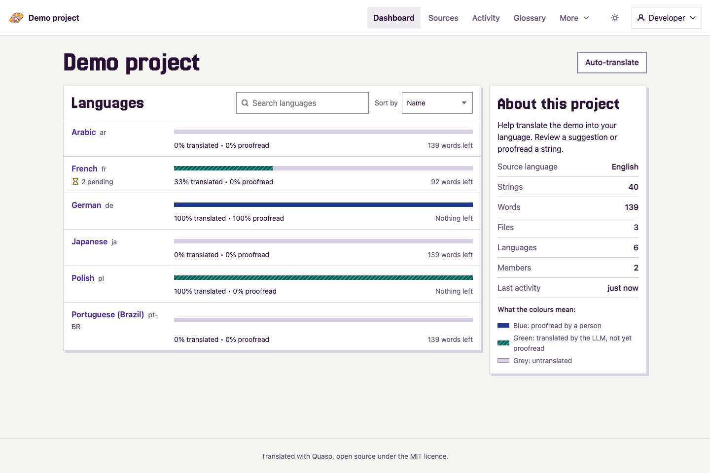
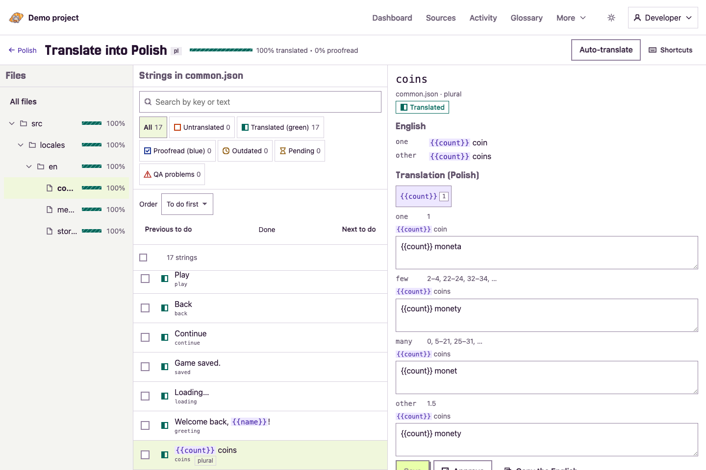
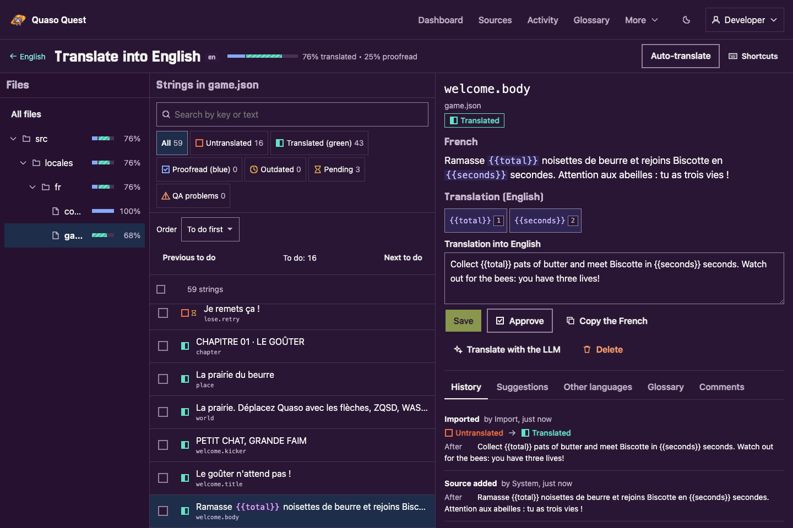

<p align="center">
  
</p>

# Quaso

An open-source localization platform for games that use [i18next](https://www.i18next.com/)
JSON files.

Developers write in one source language and upload the files with a CLI. An LLM translates new
strings at once, people proofread its work on a public website, and the CLI downloads the
translation files back into the repository. Each game runs its own instance, for example at
`translate.yourgame.com`, with Docker Compose on a VM or on Cloudflare.

- **No limits** on words, strings or languages. Only storage and the LLM bill limit an instance.
- **LLM first, people second.** New strings can be translated automatically after an upload;
  volunteers and managers proofread afterwards.
- **Your files are never at risk.** The CLI never changes the source files, downloads are
  byte-stable, and unreviewed work never reaches the files.
- **Human work is never lost.** The LLM never overwrites a proofread translation, and every change
  is kept in history.
- **Easy to run.** One Deno application and one SQLite database, in one Docker container.

Quaso 1.0 is in release-candidate testing. See the [documentation](docs/README.md) and
[release process](docs/releasing.md). The public package names and registry publishing must be set
up before installing release artifacts; development works from this repository.







## Quick start

| I want to…                       | Read                                                         |
| -------------------------------- | ------------------------------------------------------------ |
| Deploy Quaso with Docker Compose | [docs/deploy-docker.md](docs/deploy-docker.md)               |
| Deploy Quaso on Cloudflare       | [docs/deploy-cloudflare.md](docs/deploy-cloudflare.md)       |
| Add Quaso to my game             | [docs/add-to-your-game.md](docs/add-to-your-game.md)         |
| Run the translation workflow     | [docs/workflow.md](docs/workflow.md)                         |
| Use the CLI                      | [docs/cli.md](docs/cli.md)                                   |
| Move from Crowdin                | [docs/migrate-from-crowdin.md](docs/migrate-from-crowdin.md) |
| Work on Quaso                    | [CONTRIBUTING.md](CONTRIBUTING.md)                           |

## Working on Quaso

You need [Deno](https://deno.com/) 2.9.6 (pinned in `.dvmrc`) and git:

```sh
git clone 'https://github.com/<org>/quaso.git'
cd quaso
deno install --frozen-lockfile
deno task dev
```

`deno task dev` starts a working Quaso with a demo project, hot reloading, a signed-in developer
account and a fake translator, with no accounts, keys, Docker or cloud services. See
[CONTRIBUTING.md](CONTRIBUTING.md).

## Licence

[MIT](LICENSE).
