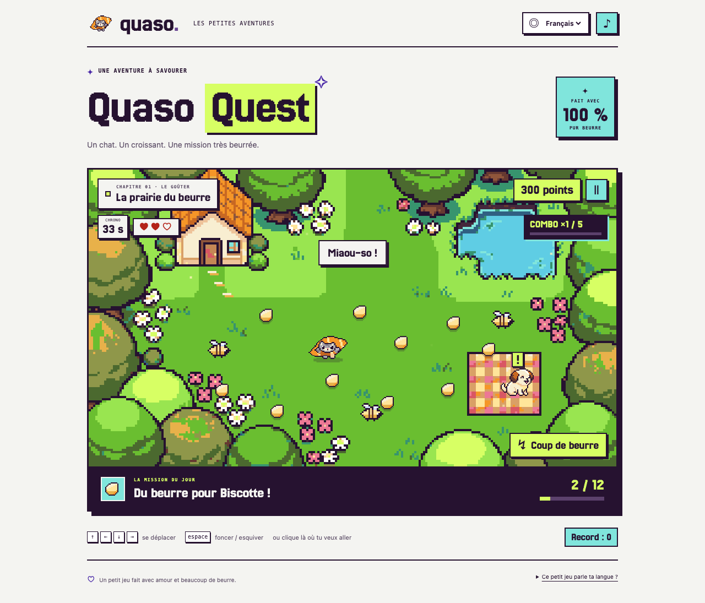

# Quaso Quest

A tiny, buttery adventure starring Quaso, a cat who happens to be a croissant. Collect twelve
pieces of butter, dodge the bees, and bring the picnic back to Monsieur Biscotte before the tea gets
cold. Pet the croissant. Listen to the little noises. Chase a gold medal.

The game starts in **French**. **English and German are supported but deliberately empty**, so you
can try the complete Quaso translation workflow on a real, playable game.



## Play

Install [Node.js](https://nodejs.org/) 22.12 or newer, then:

```sh
cd examples/demo-game
npm install
npm run dev
```

Open <http://127.0.0.1:5173>. Move with the arrows, WASD, or ZQSD; press Space to dash and Escape
to pause. You can also click or tap the meadow to move. The rules fit on the start screen:

- Bring all twelve butter pats to Biscotte in 35 seconds, with three lives.
- Bees follow predictable patrols. A dash passes through them safely; a hit breaks your combo.
- Collect the next butter pat within two seconds to build a combo, up to ×5 points.
- Finish quickly for a time bonus. A delivery earns bronze; 4,500 points earns silver; 6,500 points
  with no bee hits earns gold. Learn a route and time your dashes to beat your record.

Synthesized sound effects start with the game; the sound button toggles them and remembers your
preference. The interface uses Quaso's own pixel fonts, square controls, and plum/lime/mint palette.

`npm run build` creates a standalone website in `dist/`; `npm run preview` previews it.

## Translate your first string

You also need Docker with Docker Compose (Docker Desktop includes both). From this directory:

```sh
npm run quaso:setup
```

This starts `docker compose up -d --wait`, creates a **Quaso Quest** project with French as its
source language, creates a local administrator and an upload API key, and uploads the two French
JSON files using the Quaso CLI. It prints the login for <http://127.0.0.1:8000> and saves your local
credentials in `.env.quaso`, which git ignores. Re-running it preserves your translations and uploads
any changes to the French text. The first run downloads the official Quaso Docker image.

1. Sign in to Quaso using the printed email and password.
2. Open **English**, find `game.json` → `welcome.start`, and translate `C'est parti !` to `Let's go!`.
3. Save the translation, then download it:

   ```sh
   npm run quaso -- download
   ```

4. Reload the game, choose **English**, and see your words on the start button. Untranslated text
   still appears in French. You can also open <http://127.0.0.1:5173/?lang=en> or `?lang=de` directly.

No LLM key is needed to translate by hand. To try automatic translation, configure a Gemini key
in Quaso's **Settings → LLM translation**, then run `npm run quaso -- translate --language en` and
download again. Automatic translation is off initially so both target languages start empty.

## The everyday loop

```sh
npm run quaso -- upload                   # Send changed French text to Quaso.
npm run quaso -- status                   # See progress for English and German.
npm run quaso -- download                 # Bring translations into src/locales/.
npm run quaso -- status --fail-on untranslated  # Try the release completeness check.
```

Keep `{{count}}`, `{{score}}`, and other placeholders intact when translating. Try a long start
button translation to exercise the 24-character limit. The butter counter includes zero, singular,
and plural forms; the meows are an array. The game is small enough to inspect every source string.

`npm run quaso -- …` runs the installed `@quaso-i18n/cli` with `.env.quaso` loaded. To use `npx quaso`
directly, export `QUASO_HOSTNAME` and `QUASO_API_KEY` from that file into your shell. For a different
instance, change those values to its URL and an upload-scoped API key; use a fresh project whose
source language is French. The setup script always manages the local playground.

## Find your way around the code

| File                                 | What to look for                                                                       |
| ------------------------------------ | -------------------------------------------------------------------------------------- |
| `src/i18n.js`                        | The complete translation integration: load JSON, fall back to French, change language. |
| `src/locales/fr/common.json`         | Menus, controls, and the surrounding page.                                             |
| `src/locales/fr/game.json`           | Dialogue, quest text, plurals, and interpolation.                                      |
| `src/locales/en/`, `src/locales/de/` | Empty catalogs, filled by `quaso download`.                                            |
| `quaso.config.json`                  | French source files, target languages, output paths, and a length limit.               |
| `src/game.js`                        | Small game rules: movement, patrols, dash, combos, clock, and medals.                  |
| `src/main.js`                        | Drawing and interaction, with `t("game:…")` calls at the UI boundary.                  |
| `src/style.css`                      | Layout, responsive UI, and little bounces.                                             |
| `scripts/setup.mjs`                  | Local Docker setup and the initial CLI upload.                                         |

Quaso is a development tool: the running game reads ordinary i18next JSON and never needs to
connect to the Quaso server. Downloaded files are included in the next Vite build. `npm test`
checks the game rules and translation behavior.

## Manage the playground

```sh
docker compose up -d       # Start again; translations are kept in the named volume.
docker compose logs --tail 100 quaso
docker compose down       # Stop; keep your translations.
```

Port 8000 must be free. This Compose project is named `quaso-quest` and listens only on your
computer's loopback interface. Its setup key is intentionally public for local testing; use the
[deployment guide](../../docs/deploy-docker.md) for a real public instance. To test changes to Quaso
itself from this checkout, run `docker compose up -d --build --wait`.

For a completely fresh playground, `docker compose down -v` **deletes its server data**, including
accounts and translations. Then run `npm run quaso:setup` again. Downloaded translation files stay
in `src/locales/en/` and `src/locales/de/`; restore their contents to `{}` if you also want the game
to start untranslated again.

The sample workflows in `.github/workflows/` show source upload and translation download in CI.
Copy them to your game's repository and configure `QUASO_HOSTNAME` and `QUASO_API_KEY`. See
[Add Quaso to your game](../../docs/add-to-your-game.md) for details and monorepo adjustments.
